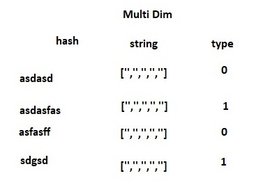

# HACKIITK

## Currently we have done this for static file only

we did this

From Benign:
    We have iterated over folders hashes
    We put all strings in hashes folder as multidimensional string
    WE distributed 60% for Train and rest as Test dataset
    Created a Type column with 0

From Malware:
    We have iterated over folders hashes
    We put all strings in hashes folder as multidimensional string
    WE distributed 60% for Train and rest as Test dataset
    Created a Type column with 1

Using Encoder we ecnoded hash,string from object to int64 

Now Uses XGBoost Classifier to fit our model 
and classify it as malware or benign

Also tried fuzzywuzzy to match columns percentage

that Test with benign strings and malware strings

Usage python3 "malware check.py" "c:\HashContainingParentFolders"
